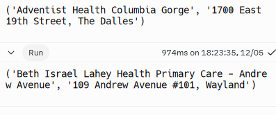

# UrgentLocate

Allowing easy access to directions to get your medical emergencies resolved quickly.


## Table of Contents

1. [Overview](#overview)
2. [Academics](#academics)
3. [User Stories](#user-stories)
4. [Running the Program](#running-the-program)
5. [Dependencies](#dependencies)
6. [Work in Progress](#work-in-progress)
6. [Disclaimer](#disclaimer)

## Overview

A web app that helps you locate emergency services based on need.

## Academics

This application was built for Project 2 for EC 601 at Boston University.

## User Stories

User Story information is located [here](/project2_us.pdf).

## Running the Program

Currently, the app can be run as a Python script in a terminal with the following:
```bash
python locate.py
```

Outputs give a tuple with the location of the hospital and its address.

Example Outputs:



## Dependencies

Google Maps API
- Place
- Geolocation

You may need to get your own Google API key from the Google Cloud service for this application to work appropriately.

## Work in Progress

Many features are still being implemented since my computer is having trouble
with the RESTful requests being made with the _Axios_ library in JS due to CORS and getting bad
locations. The program is currently only made to give you the closest hospital to
your location.

## Disclaimer

This app is not built to handle actual emergencies. It was built as a POC for a class.
